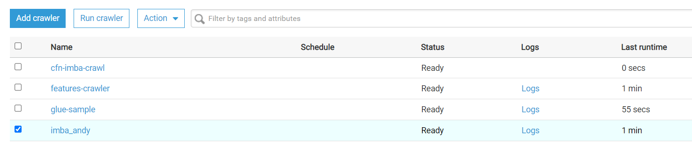
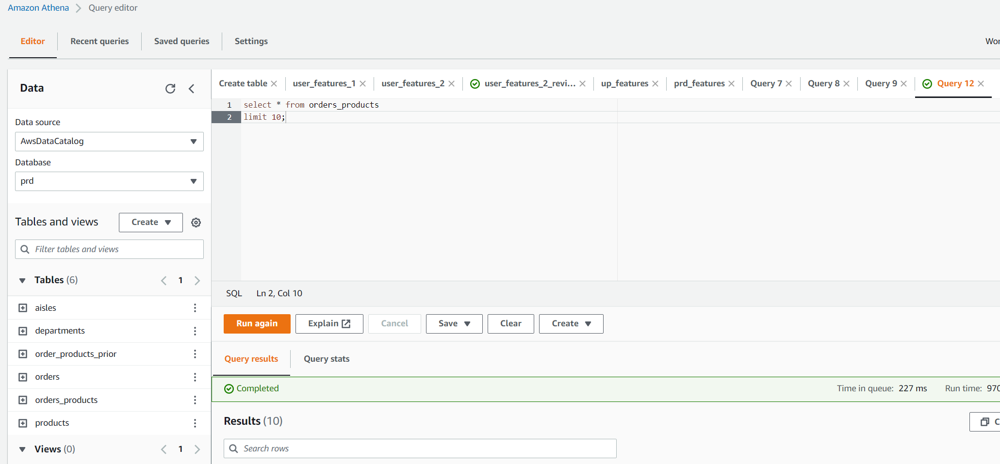

### Data Preparation
***
**1. Create S3 Bucket and Upload csv files**

***
**2. Use Glue Crawler to check the data**

***
**3. Use Athena to Audit the data**

***
**4. Draw an ER diagram to show the relationships of 5 tables**

***
**5. Code as Infrastructure**
use the AWS cloudformation template to create an AWS S3 Bucket by run workflows in github action to faciliate CI/CD processes

- CloudFormation template
```yaml
Parameters:
  BucketName:
    Description: Name your Bucket
    Type: String

Resources:
  S3Bucket:
    Type: AWS::S3::Bucket
    Properties:
      AccessControl: Private
      BucketName: !Ref BucketName
      BucketEncryption:
        ServerSideEncryptionConfiguration:
          - ServerSideEncryptionByDefault:
              SSEAlgorithm: AES256
```
- Github workflow yml file
```yaml
name: Deploy CloudFormation Stacks

# Controls when the action will run.
on:
  # Allows you to run this workflow manually from the Actions tab
  workflow_dispatch:
    inputs:
      region:
        description: "AWS Region"
        required: true
        default: "ap-southeast-2"
      bucketName:
        description: "S3 Bucket Name"
        default: "imba-andy"
        required: true

# A workflow run is made up of one or more jobs that can run sequentially or in parallel
jobs:
  cfn-deployment:
    runs-on: ubuntu-latest
    steps:
      - name: Checkout
        uses: actions/checkout@v2

      - name: Configure AWS credentials
        id: creds
        uses: aws-actions/configure-aws-credentials@v1
        with:
          aws-access-key-id: ${{ secrets.AWS_ACCESS_KEY_ID }}
          aws-secret-access-key: ${{ secrets.AWS_SECRET_ACCESS_KEY }}
          aws-region: ${{ github.event.inputs.region }} 

      - name: Deploy S3 Buckets CloudFormation Stacks
        id: s3-buckets
        uses: aws-actions/aws-cloudformation-github-deploy@v1.0.3
        with:
          name:  s3-buckets
          template: cfn/s3.yml
          parameter-overrides: >-
            BucketName=${{ github.event.inputs.bucketName }}
```
use the AWS cloudformation template to deploy an AWS crawler by run workflows in github action to faciliate CI/CD processes
- CloudFormation template
```yaml
# Build a stack for crawler services
Parameters:
  CFNCrawlerName: 
    Type: String
    Default: cfn-imba-crawl
  CFNDatabaseName:
    Type: String
    Default: cfn-imba
  CFNTablePrefixName:
    Type: String
    Default: cfn_sample_imba_	

# Resources section defines metadata for the Data Catalog
Resources:
#Create IAM Role assumed by the crawler. For demonstration, this role is given all permissions.
  CFNRoleImba:
    Type: AWS::IAM::Role
    Properties:
      AssumeRolePolicyDocument:
        Version: "2012-10-17"
        Statement:
          -
            Effect: "Allow"
            Principal:
              Service:
                - "glue.amazonaws.com"
            Action:
              - "sts:AssumeRole"
      Path: "/"
      Policies:
        -
          PolicyName: "root"
          PolicyDocument:
            Version: "2012-10-17"
            Statement:
              -
                Effect: "Allow"
                Action: "*"
                Resource: "*"
 # Create a database to contain tables created by the crawler
  CFNDatabasePrd:
    Type: AWS::Glue::Database
    Properties:
      CatalogId: !Ref AWS::AccountId
      DatabaseInput:
        Name: !Ref CFNDatabaseName
        Description: "AWS Glue container to hold metadata tables for the imba crawler"
 #Create a crawler to crawl the ecommerce data on a public S3 bucket
  CFNCrawlerImba:
    Type: AWS::Glue::Crawler
    Properties:
      Name: !Ref CFNCrawlerName
      Role: !GetAtt CFNRoleImba.Arn
      #Classifiers: none, use the default classifier
      Description: AWS Glue crawler to crawl imba data
      #Schedule: none, use default run-on-demand
      DatabaseName: !Ref CFNDatabaseName
      Targets:
        S3Targets:
          # Public S3 bucket with the flights data
          - Path: "s3://imba-andy/data/"
      TablePrefix: !Ref CFNTablePrefixName
      SchemaChangePolicy:
        UpdateBehavior: "UPDATE_IN_DATABASE"
        DeleteBehavior: "LOG"
      Configuration: "{\"Version\":1.0,\"CrawlerOutput\":{\"Partitions\":{\"AddOrUpdateBehavior\":\"InheritFromTable\"},\"Tables\":{\"AddOrUpdateBehavior\":\"MergeNewColumns\"}}}"
```
- Github workflow yml file
```yaml
name: Deploy CloudFormation Stacks

# Controls when the action will run.
on:
  # Allows you to run this workflow manually from the Actions tab
  workflow_dispatch:
    inputs:
      region:
        description: "AWS Region"
        required: true
        default: "ap-southeast-2"
      CFNDatabaseName:
        description: "Crawler database Name"
        default: "prd-cf"
        required: true

# A workflow run is made up of one or more jobs that can run sequentially or in parallel
jobs:
  cfn-deployment:
    runs-on: ubuntu-latest
    steps:
      - name: Checkout
        uses: actions/checkout@v2

      - name: Configure AWS credentials
        id: creds
        uses: aws-actions/configure-aws-credentials@v1
        with:
          aws-access-key-id: ${{ secrets.AWS_ACCESS_KEY_ID }}
          aws-secret-access-key: ${{ secrets.AWS_SECRET_ACCESS_KEY }}
          aws-region: ${{ github.event.inputs.region }} 

      - name: Deploy Crawler CloudFormation Stacks
        id: aws-crawler-imba
        uses: aws-actions/aws-cloudformation-github-deploy@v1.0.3
        with:
          name:  aws-crawler-imba
          template: cfn/crawler.yml
          parameter-overrides: >-
            CFNDatabaseName=${{ github.event.inputs.CFNDatabaseName }}
```