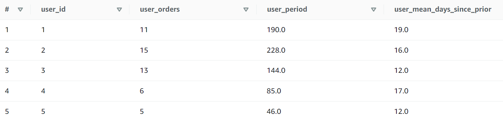
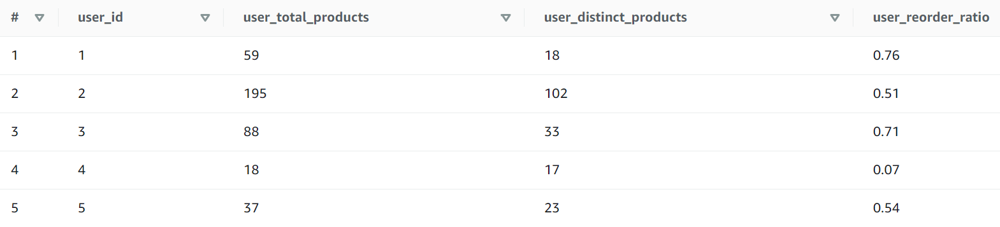
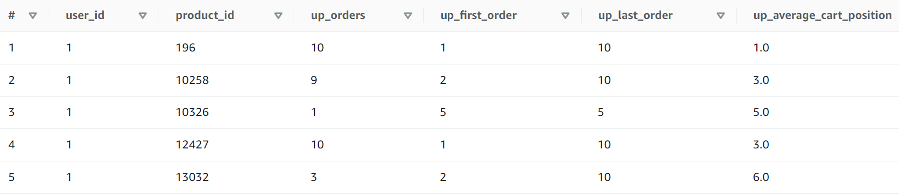
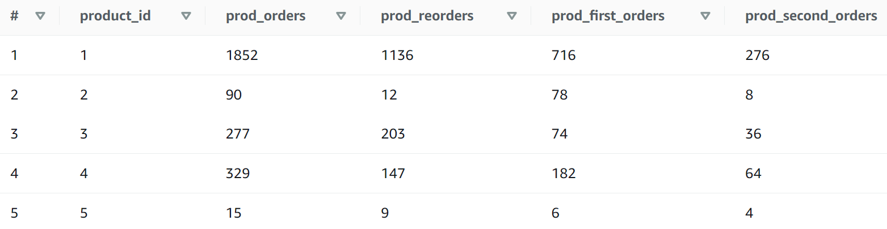

### Create SQL queries in AWS Athena
***
#### 1.Create a table called order_products_prior
```sql
create table order_products_prior with (external_location='s3://imba-andy/features/order_products_prior/', format = 'parquet')

as(
select a.*, 
       b.product_id, 
       b.add_to_cart_order,
       b.reordered
from "prd"."orders" a 
     join
     "prd"."orders_products" b
     on a.order_id = b.order_id
where a.eval_set = 'prior');
```
Table order_products_prior preview:

***
#### 2.Create a SQL query (user_features_1). Based on table orders, for each user, calculate the max order_number, the sum of days_since_prior_order and the average of days_since_prior_order.
```sql
select user_id,
       max(order_number) as user_orders,
       sum(days_since_prior_order) as user_period,
       round(avg(days_since_prior_order),0) as user_mean_days_since_prior
from "prd"."orders"
group by user_id
order by user_id;
```
Resulting table user_features_1 preview:

***
#### 3.Create a SQL query (user_features_2). Similar to above, based on table order_products_prior, for each user calculate the total number of products, total number of distinct products, and user reorder ratio(number of reordered = 1 divided by number of order_number > 1)
```sql
select user_id,
       count(product_id) as user_total_products,
       count(distinct product_id) as user_distinct_products,
       round(cast(sum(reordered) as double)/cast(sum(case when order_number>1 then 1 else 0 end) as double),2) as user_reorder_ratio
from "prd"."order_products_prior"
group by user_id
order by user_id;
```
Resulting table user_features_2 preview:

***
#### 4.Create a SQL query (up_features). Based on table order_products_prior, for each user and product, calculate the total number of orders, minimum order_number, maximum order_number and average add_to_cart_order.
```sql
select user_id,
       product_id,
       count(distinct order_id) as up_orders,
       min(order_number) as up_first_order,
       max(order_number) as up_last_order,
       round(avg(add_to_cart_order),0) as up_average_cart_position
from "prd"."order_products_prior"
group by user_id, product_id
order by user_id, product_id;
```
Resulting table up_features preview:

***
#### 5.Create a SQL query (prd_features). Based on table order_products_prior, first write a sql query to calculate the sequence of product purchase for each user, and name it product_seq_time (For example, if a user first time purchase a product A, mark it as 1. If it’s the second time a user purchases a product A, mark it as 2).Then on top of this query, for each product, calculate the count, sum of reordered, count of product_seq_time = 1 and count of product_seq_time = 2.
```sql
with list
as (select *,
       row_number() over(partition by user_id, product_id order by order_number ASC) as product_seq_time
    from "prd"."order_products_prior"
    order by user_id, order_number, add_to_cart_order)

select product_id,
       count(order_id) as prod_orders,
       sum(reordered) as prod_reorders,
       sum(case when product_seq_time = 1 then 1 else 0 end) as prod_first_orders,
       sum(case when product_seq_time = 2 then 1 else 0 end) as prod_second_orders
from list
group by product_id
order by product_id;
```
Resulting table prd_features preview:
