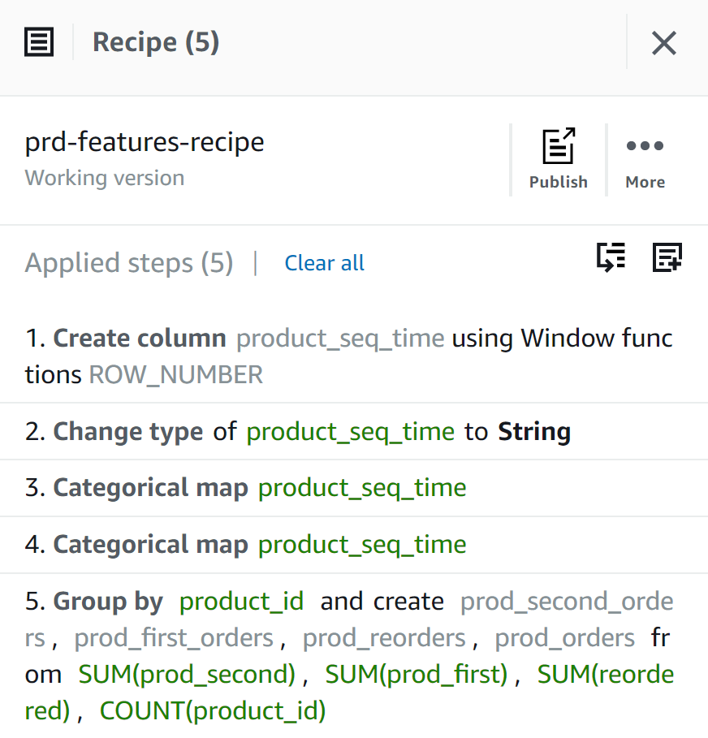

### ETL process using AWS DataBrew and AWS glue studio
The ETL process

***
**1.Create datasets in AWS DataBrew**
AWS DataBrew can conviniently clean and normalise data for ananlytics tasks

***
**2.Create projects and associative recipes**

- user_features_1

- user_features_2

- up_features

- prd_features

***
**3.Create jobs to generate parquet files for each feature table and store them into AWS S3 Bucket**

**4.Use glue studio to read the parquet files and join the four relational feature tables into one single table. Then export the dataframe as a single csv into s3 bucket**
